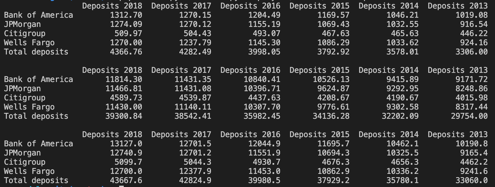

# fractional-reserve-banking

Python script which display datatables containing statistics about money deposited, money created and money supply annualy by each bank present inside the CSV file passed as parameter.

## Installation

Python 3 and Pipenv are required in order to run this program.

### OSX

```bash
brew install python3
```
```bash
brew install pipenv
```

## Usage

If you want to test the script manually, you can achieve this by doing :

```bash
cd module
pipenv install
pipenv run python3 index.py display <CSV file>
```

## Example

<p align="center">
  
</p>

## Executable

If you want to build a cross-platform executable, you need to execute the following bash commands :

```bash
cd module
pipenv install
pipenv install pyinstaller
pipenv run pyinstaller index.py --onefile
```

The executable file will be located on the generated dist folder.

## License

[GNU General Public License v3.0](https://www.gnu.org/licenses/gpl-3.0.en.html)